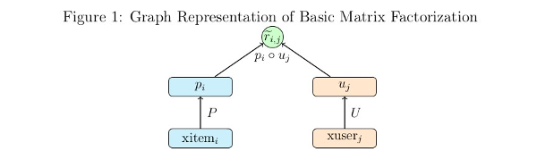
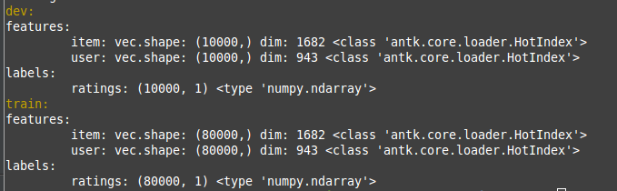
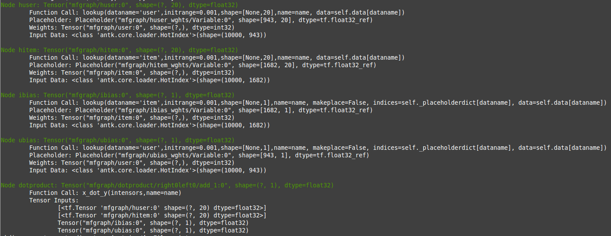
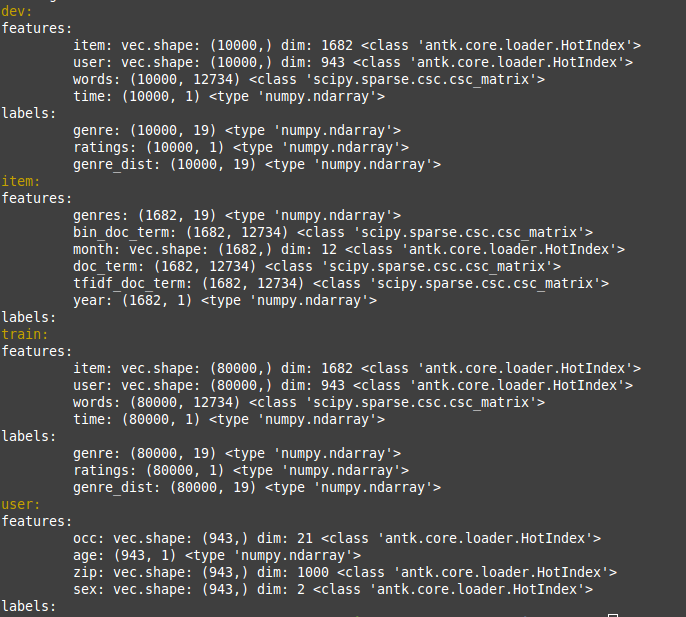

============================================
All in One Tutorial via Matrix Factorization
============================================

Part 1 starts off with a somewhat gentle introduction to the toolkit by implementing basic matrix factorization ratings
prediction on the MovieLens 100k dataset. Read the directions carefully and be prepared
use your copy and pasting skills. Part 2 explores developing a more complex model using deep neural nets to incorporated
user and item meta data into the model.
Carefully reading parts 1 and 2 will pay off when you engage in the task of building a new model.

Part 1: Matrix Factorization Model
**********************************

Low Rank Matrix Factorization is a popular machine learning technique used to produce recommendations
given a set of ratings a user has given an item. The known ratings are collected in a user-item utility matrix
and the missing entries are predicted by optimizing a low rank factorization of the utility matrix given the known
entries. The basic idea behind matrix factorization models is that the information encoded for items
in the columns of the utility matrix, and for users in the rows of the utility matrix is not
exactly independent. We optimize the objective function :math:`\sum_{(u,i)} (R_{ui} - P_i^T U_u)^2` over the observed
ratings for user *u* and item *i* using gradient descent.

.. image:: _static/factormodel.png
    :align: center

We can express the same optimization in the form of a computational graph that will play nicely with tensorflow:

Here :math:`xitem_i`, and :math:`xuser_j` are some representation of the indices for the user and item vectors in the utility matrix.
These could be one hot vectors, which can then be matrix multiplied by the *P* and *U* matrices to select the corresponding
user and item vectors. In practice it is much faster to let :math:`xitem_i`, and :math:`xuser_j` be vectors of indices
which can be used by tensorflow's **gather** or **embedding_lookup** functions to select the corresponding vector from
the *P* and *U* matrices.

This simple model isn't difficult to code directly in tensorflow, but it's simplicity allows a
demonstration of the functionality of the toolkit without having to tackle a more complex model.

We have some processed MovieLens 100k data prepared for this tutorial located at http://sw.cs.wwu.edu/~tuora/aarontuor/ml100k.tar.gz .
The original MovieLens 100k dataset is located at http://grouplens.org/datasets/movielens/ .

To start let's import the modules we need, retrieve our prepared data,
 and use the :any:`loader` module's :any:`read_data_sets` function to load our data:

.. code-block:: python

    import tensorflow as tf
    from antk.core import config
    from antk.core import generic_model
    from antk.core import loader

    loader.maybe_download('ml100k.tar.gz', '.',
                      'http://sw.cs.wwu.edu/~tuora/aarontuor/ml100k.tar.gz')
    loader.untar('ml100k.tar.gz')
    data = loader.read_data_sets('ml100k', folders=['dev', 'train'],
                                  hashlist=['item', 'user', 'ratings'])

There is a lot more data in the ml100k folder than we need for demonstrating a basic MF model so we use the **hashlist** and
**folders** arguments to select only the data files we want.
We can view the dimensions types, and dictionary keys of the data we've loaded using the :any:`DataSets.show` method,
which is a useful feature for debugging.

.. code-block:: python

    data.show()

The previous command will display this to the terminal:

For this data there are 10,000 ratings in dev and test, and 80,000 ratings in train.
Notice that the data type of *item* and *user* above is :any:`HotIndex`. This is a data structure for storing
one hot vectors, with a field for a vector of indices into a one hot matrix and the column size of the one hot matrix.
This will be important as we intend to use the :any:`lookup` function, which takes :any:`HotIndex`
objects for its *data* argument, makes a placeholder associated with this data and uses the :any:`dim` attribute of the :any:`HotIndex`
data to create a **tf.Variable** tensor with the correct dimension. The output is an **embedding_lookup** using the placeholder
and variable tensors created.

This model does better with the target ratings centered about the mean so let's center the ratings.

.. code-block:: python

    data.train.labels['ratings'] = loader.center(data.train.labels['ratings'])
    data.dev.labels['ratings'] = loader.center(data.dev.labels['ratings'])

.. todo:: Make a plain text file named mf.config using the text below. We will use this to make the tensorflow computational graph:

.. code-block:: python

    dotproduct x_dot_y()
        -huser lookup(dataname='user', initrange=0.001, shape=[None, 100])
        -hitem lookup(dataname='item', initrange=0.001, shape=[None, 100])
        -ibias lookup(dataname='item', initrange=0.001, shape=[None, 1])
        -ubias lookup(dataname='user', initrange=0.001, shape=[None, 1])

The python syntax highlighting illustrates the fact that
the node specifications in a .config file are just python function calls with two things omitted, the first argument
which is a tensor or list of tensors, and the last argument which is the name of the tensor output which defines it's unique
variable scope. The first argument is derived from the structure of the config spec, inferred by a marker symbol which we have
chosen as '-'. The input is
the list of tensors or the single tensor in the spec at the next level below a node call. Tabbing is optional. It may be easier to read
a config file with tabbing if you are using node functions without a long sequence of arguments.
The second omitted argument, the name, is whatever directly follows the graph markers.

Now we make an :any:`AntGraph` object.

.. code-block:: python

    with tf.variable_scope('mfgraph'):
    ant = config.AntGraph('mf.config',
                            data=data.dev.features,
                            marker='-',
                            develop=True)

When you run the code now you will get a complete print of the tensors made from the config file because we have set the
**develop** argument to **True**.

We can get a visual representation of the graph with another line:

.. code-block:: python

    ant.display_graph()

When you run this code a graphviz dot pdf image of the graph you have composed should pop up on the screen (assuming you
have graphviz installed). This pdf file will show up in the pics folder with the name **no_name.pdf**. There are of course
parameters for specifying the name and location where you want the picture to go. The dot specification will be located
in the same place as the picture and be named **no_name.dot** unless you have specified a name for the file.

.. image:: _static/no_name.png
    :align: center

Shown in the graph picture above the :any:`x_dot_y` function takes a list of tensors as its first argument.
The first two tensors are matrices whose rows are dot producted resulting in a vector containing a scalar for each row.
The second two tensors are optional biases. For this model, giving a user and item bias helps a great deal. When :any:`lookup`
is called more than once in a config file using the same *data* argument the previously made placeholder tensor is used,
so here *ibias* depends on the same placeholder as *hbias* and *ubias* depends on the same placeholder as *huser*, which
is what we want.

The :any:`AntGraph` object, *ant* is a complete record of the tensors created in graph building.
There are three accessible fields, :any:`tensordict`, :any:`placeholderdict`, and :any:`tensor_out`,
which are a dictionary of non-placeholder tensors made during graph creation, a dictionary of placeholder tensors made during
graph creation and the tensor or list of tensors which is the output of the top level node function.
These should be useful if we want to access tensors post graph creation.

Okay let's finish making this model:

.. code-block:: python

    y = ant.tensor_out
    y_ = tf.placeholder("float", [None, None], name='Target')
    ant.placeholderdict['ratings'] = y_ # put the new placeholder in the placeholderdict for training
    objective = (tf.reduce_sum(tf.square(y_ - y)) +
                 0.1*tf.reduce_sum(tf.square(ant.tensordict['huser'])) +
                 0.1*tf.reduce_sum(tf.square(ant.tensordict['hitem'])) +
                 0.1*tf.reduce_sum(tf.square(ant.tensordict['ubias'])) +
                 0.1*tf.reduce_sum(tf.square(ant.tensordict['ibias'])))
    dev_rmse = tf.sqrt(tf.div(tf.reduce_sum(tf.square(y - y_)), data.dev.num_examples))

    model = generic_model.Model(objective, ant.placeholderdict,
              mb=500,
              learnrate=0.01,
              verbose=True,
              maxbadcount=10,
              epochs=100,
              evaluate=dev_rmse,
              predictions=y)

Notice that the :any:`tensordict` enables easy access to *huser*, *hitem*, *ubias*, *ibias*, which we want to regularize to
prevent overfitting. The :any:`Model` object we are creating *model* needs the fields *objective*, *placeholderdict*, *predictions*, and *targets*.
If you don't specify the other parameters default values are set. *objective* is used as the loss function for gradient
descent. *placeholderdict* is used to pair placeholder tensors with matrices from a dataset dictionary with the same
keys. *targets*, and *predictions* are employed by the loss function during evaluation, and by the prediction function
to give outputs from a trained model.

Training is now as easy as:

.. code-block:: python

    model.train(data.train, dev=data.dev)

You should get about 0.92 RMSE.

There are a few antk functionalities we can take advantage of to make our code more compact. Any node_op function that
creates trainable weights has a parameter for adding l2 regularization to the weights of the model. We just change
our config as below and we can eliminate the four extra lines in the definition of **objective**.

.. code-block:: python

    dotproduct x_dot_y()
        -huser lookup(dataname='user', initrange=0.001, l2=0.1, shape=[None, 100])
        -hitem lookup(dataname='item', initrange=0.001, l2=0.1, shape=[None, 100])
        -ibias lookup(dataname='item', initrange=0.001, l2=0.1, shape=[None, 1])
        -ubias lookup(dataname='user', initrange=0.001, l2=0.1, shape=[None, 1])

Also, we have a function for RMSE, and we can evaluate the mean absolute error using
the **save_tensors** argument to the :any:`generic_model` constructor. Our code now looks like this:

.. code-block:: python

    y = ant.tensor_out
    y_ = tf.placeholder("float", [None, None], name='Target')
    ant.placeholderdict['ratings'] = y_ # put the new placeholder in the graph for training
    objective = node_ops.se(y_ - y)
    dev_rmse =  node_ops.rmse(y, y_)
    dev_mae = node_ops.mae(y, y_)

    model = generic_model.Model(objective, ant.placeholderdict,
              mb=500,
              learnrate=0.01,
              verbose=True,
              maxbadcount=10,
              epochs=100,
              evaluate=dev_rmse,
              predictions=y,
              save_tensors={'dev_mae': dev_mae})
    model.train(data.train, dev=data.dev)

If you don't wan't to evaluate a model during training, for instance if you are doing cross-validation, you can just hand the :any:`train`
method a training set and omit the dev set. Note that here there must be keys in either the :any:`DataSet`
:any:`features`, or :any:`labels` dictionaries, that match with the keys from the :any:`placeholderdict` which is handed
to the :any:`Model` constructor. In our case we have placed a placeholder with the key *ratings* in the
:any:`placeholdedict` corresponding to
the *ratings* key in our *data* :any:`DataSet`. So our :any:`placeholderdict` is:

.. code-block:: python

    {'item': <tensorflow.python.framework.ops.Tensor object at 0x7f0bea7b43d0>,
     'user': <tensorflow.python.framework.ops.Tensor object at 0x7f0bea846e90>,
     'ratings': <tensorflow.python.framework.ops.Tensor object at 0x7f0bea77fc90>}

Now we have a trained model that does pretty well but it would be nice to automate a hyper-parameter search to find the best
we can do (should be around .91).

We can change our mf.config file to accept variables for hyperparameters by substituting hard values with variable names
prefixed with a '$':

.. code-block:: python

   dotproduct x_dot_y()
        -huser lookup(dataname='user', initrange=$initrange, l2=$l2, shape=[None, $kfactors])
        -hitem lookup(dataname='item', initrange=$initrange, l2=$l2, shape=[None, $kfactors])
        -ibias lookup(dataname='item', initrange=$initrange, l2=$l2, shape=[None, 1])
        -ubias lookup(dataname='user', initrange=$initrange, l2=$l2, shape=[None, 1])

Now we have to let the :any:`AntGraph` constructor know what to bind these variables to with a *variable_bindings*
argument. So change the constructor call like so.

.. code-block:: python

    with tf.variable_scope('mfgraph'):
        ant = config.AntGraph('mf.config',
                                data=data.dev.features,
                                marker='-',
                                variable_bindings = {'kfactors': 100, 'initrange':0.001, 'l2':0.1})

.. todo::

    Modify the code you've written to take command line arguments for the hyperparameters: *kfactors*, *initrange*, *mb*, *learnrate*, *maxbadcount*, *l2*,
    and *epochs*, and conduct a parameter search for the best model.

Part 2: Tree Model
************************************

To demonstrate the power and flexibility of using a config file we can make this more complex model
below by changing a few lines of code and using a different config file:

.. image:: _static/tree1.png
    :align: center

We need to change the :any:`read_data_sets` call to omit the optional *hashlist* parameter so we get more features from
the data folder (if a *hashlist* parameter is not supplied, :any:`read_data_sets` reads all files with name prefixes
**features_** and **labels_** ).

.. todo::

    Make a new python file tree.py with the code below:

.. code-block:: python

    import tensorflow as tf
    from antk.core import config
    from antk.core import generic_model
    from antk.core import loader
    from antk.core import node_ops

    data = loader.read_data_sets('ml100k', folders=['dev', 'train', 'item', 'user'])
    data.show()

Now we have some user and item meta data which we can examine:

The idea of this model is to have a deep neural network for each stream of user meta data and item meta data. The user and item dnn's are
concatenated respectively and then fed to a user dnn and an item dnn. The outputs of these dnn's are dot producted to provide ratings predictions.
We can succinctly express this model in a .config file.

.. todo:: Make a plain text file called tree.config with the specs for our tree model.

.. code-block:: python

    dotproduct x_dot_y()
    -all_user dnn([$kfactors,$kfactors,$kfactors], activation='tanh',bn=True,keep_prob=0.95)
    --tanh_user tf.nn.tanh()
    ---merge_user concat($kfactors)
    ----huser lookup(dataname='user', initrange=$initrange, shape=[None, $kfactors])
    ----hage dnn([$kfactors,$kfactors,$kfactors],activation='tanh',bn=True,keep_prob=0.95)
    -----agelookup embedding()
    ------age placeholder(tf.float32)
    ------user placeholder(tf.int32)
    ----hsex dnn([$kfactors,$kfactors,$kfactors],activation='tanh',bn=True,keep_prob=0.95)
    -----sexlookup embedding()
    ------sex_weights weights('tnorm', [2, $kfactors])
    ------sexes embedding()
    -------sex placeholder(tf.int32)
    -------user placeholder(tf.int32)
    ----hocc dnn([$kfactors,$kfactors,$kfactors],activation='tanh',bn=True,keep_prob=0.95)
    -----occlookup embedding()
    ------occ_weights weights('tnorm', [21, $kfactors])
    ------occs embedding()
    -------occ placeholder(tf.int32)
    -------user placeholder(tf.int32)
    ----hzip dnn([$kfactors,$kfactors,$kfactors],activation='tanh',bn=True,keep_prob=0.95)
    -----ziplookup embedding()
    ------zip_weights weights('tnorm', [1000, $kfactors])
    ------zips embedding()
    -------zip placeholder(tf.int32)
    -------user placeholder(tf.int32)
    ----husertime dnn([$kfactors,$kfactors,$kfactors],activation='tanh',bn=True,keep_prob=0.95)
    -----time placeholder(tf.float32)
    -all_item dnn([$kfactors,$kfactors,$kfactors], activation='tanh',bn=True,keep_prob=0.95)
    --tanh_item tf.nn.tanh()
    ---merge_item concat($kfactors)
    ----hitem lookup(dataname='item', initrange=$initrange, shape=[None, $kfactors])
    ----hgenre dnn([$kfactors,$kfactors,$kfactors],activation='tanh',bn=True,keep_prob=0.95)
    -----genrelookup embedding()
    ------genres placeholder(tf.float32)
    ------item placeholder(tf.int32)
    ----hmonth dnn([$kfactors,$kfactors,$kfactors],activation='tanh',bn=True,keep_prob=0.95)
    -----monthlookup embedding()
    ------month_weights weights('tnorm', [12, $kfactors])
    ------months embedding()
    -------month placeholder(tf.int32)
    -------item placeholder(tf.int32)
    ----hyear dnn([$kfactors,$kfactors,$kfactors],activation='tanh',bn=True,keep_prob=0.95)
    -----yearlookup embedding()
    ------year placeholder(tf.float32)
    ------item placeholder(tf.int32)
    ----htfidf dnn([$kfactors,$kfactors,$kfactors],activation='tanh',bn=True,keep_prob=0.95)
    -----tfidflookup embedding()
    ------tfidf_doc_term placeholder(tf.float32)
    ------item placeholder(tf.int32)
    ----hitemtime dnn([$kfactors,$kfactors,$kfactors],activation='tanh',bn=True,keep_prob=0.95)
    -----time placeholder(tf.float32)
    -ibias lookup(dataname='item', shape=[None, 1], initrange=$initrange)
    -ubias lookup(dataname='user', shape=[None, 1], initrange=$initrange)

This model employs all the user and item meta-data we have at our disposal. The config file looks pretty complicated, and it is,
but at least it fits on a screen and we can *read* the high level structure of the model. Imagine developing this model with straight python tensorflow code. This would be hundreds of lines of code and it would be much more difficult to *see* what was going on with the model.
We can see what the model will look like without actually building the graph with the :any:`config.testGraph` function.

.. code-block:: python

    config.testGraph('tree.config')

This looks like a pretty cool model! We should probably normalize the meta data features for training though.

.. code-block:: python

    data.train.labels['ratings'] = loader.center(data.train.labels['ratings'], axis=None)
    data.dev.labels['ratings'] = loader.center(data.dev.labels['ratings'], axis=None)
    data.user.features['age'] = loader.center(data.user.features['age'], axis=None)
    data.item.features['year'] = loader.center(data.item.features['year'], axis=None)
    data.user.features['age'] = loader.maxnormalize(data.user.features['age'])
    data.item.features['year'] = loader.maxnormalize(data.item.features['year'])

All our other features besides time are categorical and so use lookups. I think I normalized time during data processing but
it couldn't hurt to check. If you think it is a good idea you can whiten these data inputs to have zero mean and unit variance
with some convenience functions from the :any:`loader` module. Now we should build our graph. Notice that we have omitted the
l2 variable in the config file. We are using dropout to regularize our output as an alternative, since this is a standard regularization
technique for deep neural networks.

Remember we need a python dictionary of numpy matrices whose keys match the names of placeholder and lookup operations that will
infer dimensions for the :any:`AntGraph` constructor. So we need to add these lines:

.. code-block:: python

    datadict = data.user.features.copy()
    datadict.update(data.item.features)
    configdatadict = data.dev.features.copy()
    configdatadict.update(datadict)

Now we can build the graph. We'll set **develop** to **False** because a lot of tensors are going to get made. If something
goes wrong with a model this big set **develop** to **True** and pipe standard output to a file for analysis:

.. code-block:: python

    with tf.variable_scope('mfgraph'):
        ant = config.AntGraph('tree.config',
                                data=configdatadict,
                                marker='-',
                                variable_bindings = {'kfactors': 100, 'initrange':0.001},
                                develop=False)

    y = ant.tensor_out
    y_ = tf.placeholder("float", [None, None], name='Target')
    ant.placeholderdict['ratings'] = y_  # put the new placeholder in the graph for training
    objective = tf.reduce_sum(tf.square(y_ - y))
    dev_rmse =  node_ops.rmse(y, y_)

Training this model will naturally take longer so we can set the evaluation schedule to be shorter than an epoch to check
in on how things are doing. Also, we will need a smaller learnrate for gradient descent. So we can initialize a :any:`Model` object
with the following hyper-parameters as a first approximation, and then train away...

.. code-block:: python

    model = generic_model.Model(objective, ant.placeholderdict,
                                mb=500,
                                learnrate=0.0001,
                                verbose=True,
                                maxbadcount=10,
                                epochs=100,
                                evaluate=dev_rmse,
                                predictions=y)
    model.train(data.train, dev=data.dev, supplement=datadict, eval_schedule=1000)

.. note::

    We added the supplement argument to :any:`train` so that the placeholders related to meta-data could be added to the tensorflow
    feed dictionary with the backend function :any:`get_feed_dict` employed by the :any:`Model` constructor.

This model takes a while to train and from some poking around it is hard to find a set of hyperparameters that will approach the
accuracy of a basic matrix factorization model. The hyperparameters I have provided should give about 0.93 RMSE which isn't good for this data set.
We have a lot of things to try such as batch normalization, dropout, hidden layer size,
number of hidden layers, activation functions, optimization strategies, subsets of the meta data to incorporate into the mode, and of course the
standard learning rate and intitialization strategies.

.. todo::

    Modify the code you've written to take arguments for the set of new hyperparameters, and optional optimization parameters
    from the :any:`Model` API. Perform a parameter search to see if you can do better than basic MF.

